## 課堂回饋與期末專案討論

- 個人 / 團體
> 下週開始與各組討論組別作業(11:30-12:20)；開始沒有作業的期末人生，由各組討論與分工的**分享共筆**取代。

- 自學的意義與重要
> [哈勒凡：享受自學就不怕市場劇變](http://www.cw.com.tw/article/article.action?id=5079254)
> [人人都可成為資料科學大師！一整年的網路自學清單就在這了](https://buzzorange.com/techorange/2016/02/02/plan-to-be-a-data-scientist-in-new-year/)

- 資料科學的 **基本能力** 是什麼

  - Efficient coding?
  - [Problem solving?](https://prezi.com/ffzlcg1luozx/data-science-vs-analytics-approaches-to-problem-solving/)
  - [Human-centered Design/engineering?](https://depts.washington.edu/hdsl/)
  - [The Life of a Data 
Scientist](http://www.mastersindatascience.org/careers/data-scientist/)


---
## 邁向研究 and/or 解決實際問題

> There is a massive disconnect between what is taught in universities and what is done on a daily basis (at startups).

- 選擇優秀組別作業投稿 http://group.dailyview.tw/


---
## Recap: Exploratory Data Analysis

- 作圖與統計知識是兩把瑞士刀
- **統計**可以與**機器學習**一起學習。先思考作圖：
  - 什麼樣資料適合用什麼樣的圖形表達？
  - 適當的作圖工具（library）為何？
  - 如何**生動**、產生**互動**？
- 建議學習順序：了解基本函數 `plot()` >> `(lattice)` >> `ggplot2` >> **interactive plot** (`rCharts`, `plotly`, `networkD3`, `dygraphs`, `htmlwidgets`)... (視你的應用需求而定)
  - 從 `plot` 到 `ggplot2` 之間還有 `qplot` *過渡*，可參考 `VisR_quick.R`

---
## Basic and Interactive Plots

- 取決於什麼樣的資料型態與要看什麼樣的關係，還有，妳要給讀者怎麼樣的印象與訊息。
- 製圖類型有流程判斷 (i.e., [*how to choose which type of graph to use*](https://blog.hubspot.com/marketing/data-visualization-choosing-chart))
- R 的作圖能力一流，不要浪費掉。基本指令熟悉後，可考慮用例子去學：參考 [R graph gallery](http://www.r-graph-gallery.com/) 或 [Python  graph gallery](https://python-graph-gallery.com/) 

- 作圖複雜度隨著研究應用的需求提高（e.g., 多變量，互動，動畫模擬，網路，地圖等等）


---
## Example: Scatter plot

- Scatter plots are used primarily to conduct a quick analysis of the relationships among different variables in our data. (try adding elements such as text, labels, and lines.)


```r
plot(cars)
```

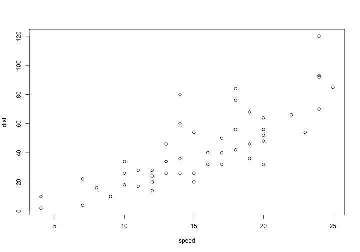

---
## Advanced scatter plot

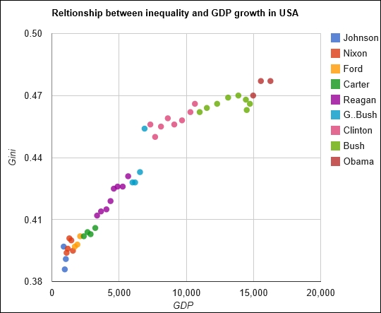
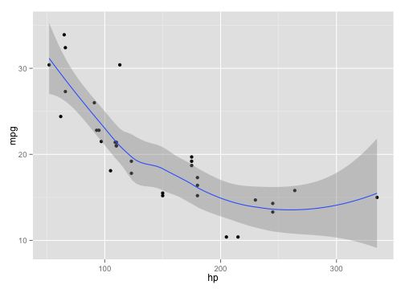

---
## 3D scatter 也可以

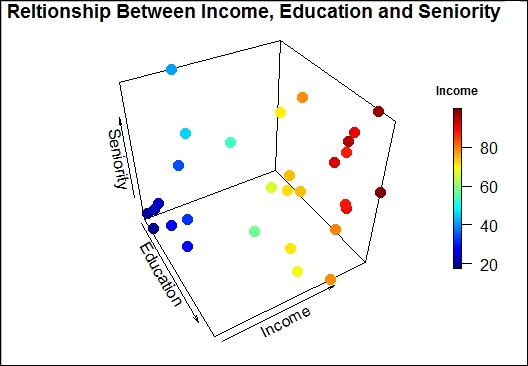


---
## Map 也沒問題

`googleVis` 的 `gvisGeoMap()`
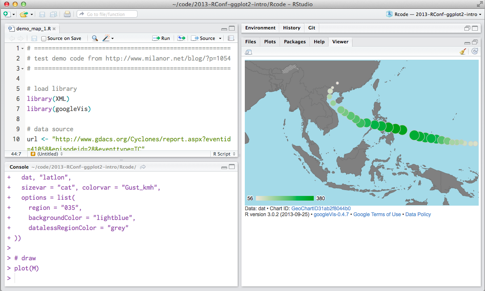

source: <http://blog.liang2.tw/2013-RConf-ggplot2-intro/>

---
## 簡言之：閱讀、觀察與實作

- 沒有捷徑；多做[練習](http://r-exercises.com/2016/11/27/string-manipulation-exercises/)
- 多利用網路資料學習，因為在技術層次教科書已經跟不上。
(https://plot.ly/r/github-getting-started-for-data-scientists/)
- 台灣 R 社群 (R User Group) 發展愈來愈好，可加入多學習 


--- bg:#FFFAF0

1. Recap
2. __``Text Analytics and NLP``__


---
## 記得這個圖吧

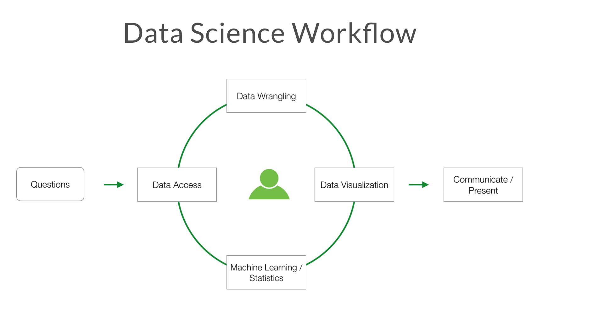


---
## 文本分析基本流程
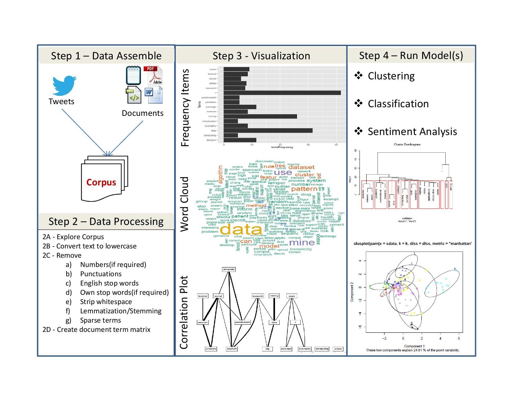</img>
[source](https://manoharswamynathan.files.wordpress.com/2015/04/r-text-mining-001.jpg)


---
## What is Text Analytics ?

- (**WHAT**): Text Analytics is the process of converting unstructured text data into meaningful data for analysis
- (**WHY**) : to measure customer opinions, product reviews, feedback, to provide search facility, sentimental analysis and entity modeling to support fact based decision making, etc. - (**HOW**): combining many linguistic, statistical, and machine learning techniques.


---
## What is Text Analytics ?

> It involves lexical analysis, categorization, clustering, pattern recognition, tagging, annotation, information extraction, link and association analysis, visualization, and predictive analytics. Text Analytics determines key words, topics, category, semantics, tags from the millions of text data available in an organization in different files and formats. The term Text Analytics is roughly synonymous with text mining.

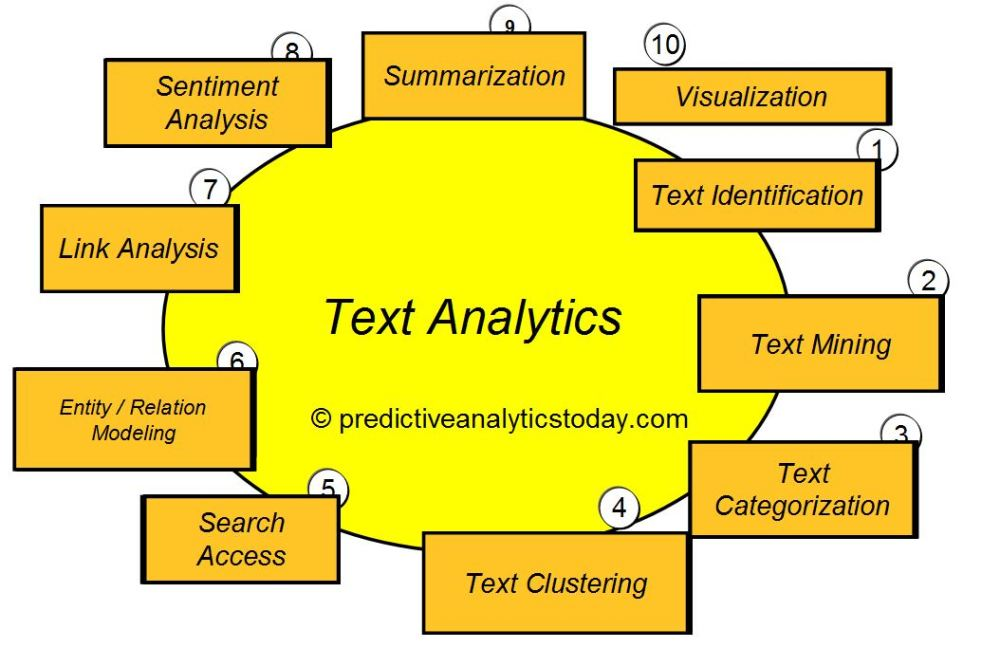</img>
  


---
## Text analytics

- **Preparing / Preprocessing text and data**. 
  - Text is unstructured or partially structured data that must be prepared for analysis. We extract features from text. We define measures. 
  - Quantitative data are messy or missing, too They may require transformation prior to analysis. Data preparation consumes much of a data scientist’s time.

- **Exploratory data analysis and Infographics** (data visualization for the purpose of discovery. We look for groups in data, find outliers, identify common dimensions, patterns, and trends.)

- **Prediction models** (Regression; Classification and Clustering;) and Evaluations (Recommender systems, collaborative filtering, association rules, optimization methods based on linguistic heuristics, as well as a myriad of methods for regression, classification, and clustering fall under the rubric of machine learning).


---
## 搭配語言學研究讓文本分析變得很厲害

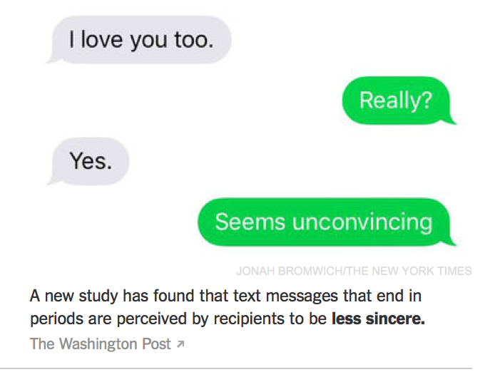</img>


---
## 遊戲時間


---
## 文本資料探索分析 (Exploratory Textual Data Analysis) 

A missing part

- Textual statistics (local and global)
- Textual data transformatio: from textual information to numerical vectors
- Corpus-based analysis and manual annotation (e.g., conversation structure) 


---
## 文本資料怎麼作圖？

- 我們想要利用視覺化技術探勘文本中的訊息、趨勢、模式變化。例如
  - 批踢踢語料中呈現的鄉民行為與社會網路
  - 不同作者的書寫風格
  - （選前選後的）政治觀點、主張、價值比較

- 基本的可能
  - 文字雲 (word cloud) 與比較
  - 關聯圖 (correlation plot) 與詞組樹 (phrase tree)
  - 調整字型 (custom fonts) 與風格 


---
## Word Cloud

- A word cloud is simply a graphical representation in which the size of the font used for the word corresponds to its frequency relative to others. Bigger the size of the word, higher is its frequency. 

- `wordcloud2`, `RColorBrewer` 都可以。


---
## (中文) 字型與符碼選擇


```r
#windowsFonts(JP = windowsFont("MS Mincho"))
#par(family = "JP")
#par(family = "STKaiti")
#wordcloud(doc, scale= c(2,0.5))
```

還有[改符號的](http://beader.me/2014/01/09/font-in-r-plot/)
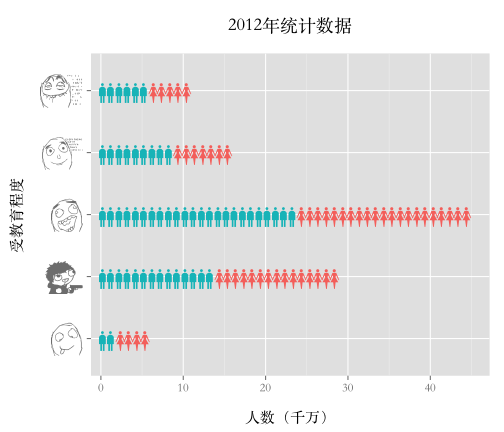


---
## 文字雲也可以比較

- To construct a **comparison cloud**, we require the data to be in the form of a term matrix. The `tm` package provides us with the `TermDocumentMatrix()` function that constructs a term document matrix:


```r
#colnames(data) <- c("bush","obama")
#comparison.cloud(data,max.words = 250, title.size = 2,colors = brewer.pal(3,"Set1"))
```
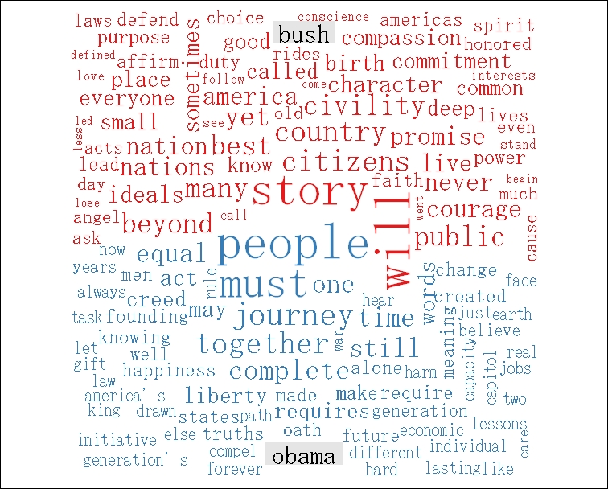


---
## 用 correlation plot 來觀察文本差異

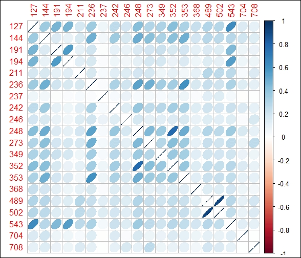

---
## 詞組樹

- A phrase tree or a word tree provides useful insight into text as it provides a context and not just the frequency of words. <https://www.jasondavies.com/wordtree/>

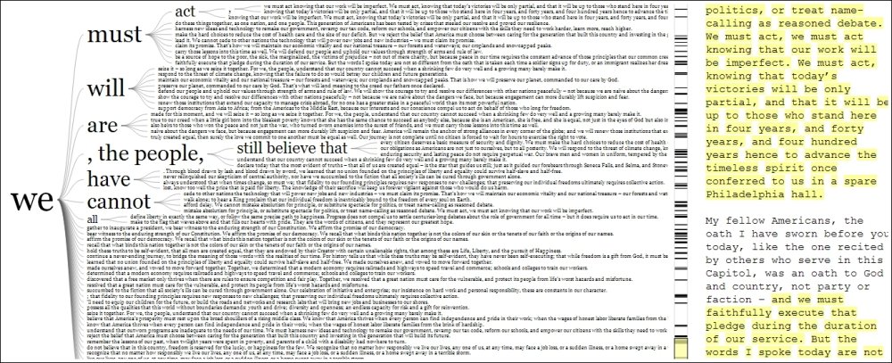


---
## 再講一個 motion chart

<iframe width="420" height="315" src="https://www.youtube.com/embed/6LUjgHPhxRw" frameborder="0" allowfullscreen></iframe>


---
## 從多變量量化語言學角度下的文本視覺化

Visualization of textual data (Ludovic Lebart and Marie Piron)

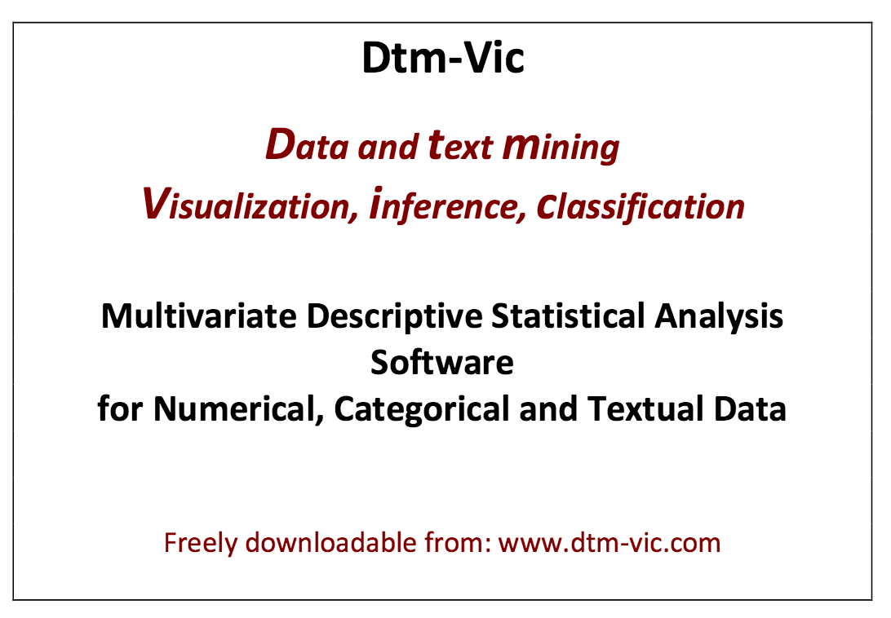


---
## 語言大數據發揮創意的話可以看到很多東西

[Google book ngram](https://books.google.com/ngrams/) 


---
## 用 R 玩看看

- [`ngramr`](https://github.com/seancarmody/ngramr): R package to query the Google Ngram Viewer 


```r
require(ngramr)
require(ggplot2)
ggram(c("monarchy", "democracy"), year_start = 1500, year_end = 2000, 
      corpus = "eng_gb_2012", ignore_case = TRUE, 
      geom = "area", geom_options = list(position = "stack")) + 
      labs(y = NULL)
```

---
## 這個圖怎麼解釋

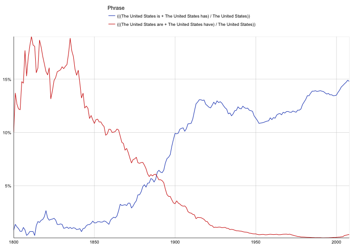

---
## 愛人與太太的消長


```r
# rownames(corpuses) 
ggram(c("愛人", "太太"), year_start = 1500, year_end = 2000,
      corpus = "chi_sim_2012", ignore_case = TRUE, 
      geom = "area", 
      geom_options = list(position = "stack"))+labs(y = NULL)
```


---
## [note] R 繪圖與中文字型

https://blog.gtwang.org/r/how-to-use-your-favorite-fonts-in-r-charts/


--- 
## 回到 Text Analytics / Text Mining / Content Analysis

典型文本分析流程 a typical text analysis process:

- 蒐集與前處理 collecting raw text and preprocessing,
- 表徵 representing text,
  - using Term Frequency-Inverse Document Frequency (TFIDF) to compute the usefulness of each word in the texts,
  - word vectors
- 分類、分群、主題與關鍵詞偵測 categorizing documents by topics using topic modeling,
- 語意與情緒（情感）分析 semantic/sentiment analysis, and
- 應用導向的洞見與預測 gaining greater insights.

如何能？！**語言資源** 與 **自然語言處理** ！！


---
## 語言資源 (Language Resources)

- 語料庫 corpus
- 詞庫 lexicon / lexical (knowledge) resources
- 知識本體 ontologies

---
## 語料庫：概念

- 語料庫 (Corpus) 是自然語言處理與文本解析的基礎建設。
a large collection of texts used for various purposes in Natural Language Processing (NLP).
- 標記 (annotation) 是核心。It's linguistic in nature.

> Good annotations support good applications


---
## 語料庫：工具

一般主要提供以下功能：
- Corpus building and indexing
- Concordance
- Frequency list
- (Grammatical) Collocations (and colligations)
- Keywords
- Thesaurus
- ngram
- Visualization

---
## 語料庫：工具

http://voyant-tools.org/?corpus=7fda0cccc3e3da40ce4f6b5c38347689

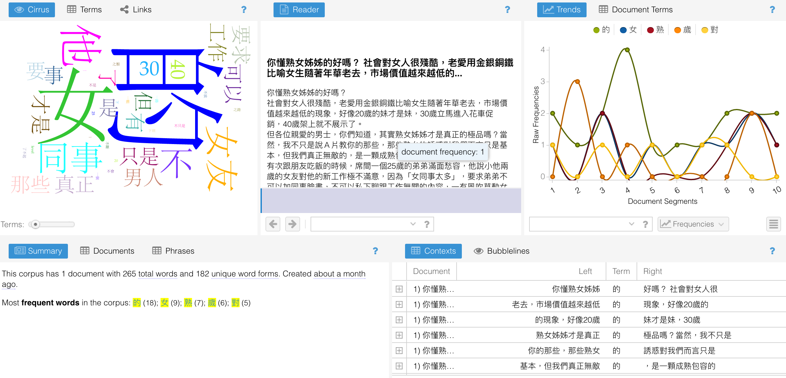</img>


---
## 語料庫：網路服務

- 較具特色的(商用)系統：[Word Sketch Engine](https://www.sketchengine.co.uk/)
- 較具特色的(開放)系統 [COPENS](http://lopen.linguistics.ntu.edu.tw/copens)/pttCorpus <- 敝帚自珍

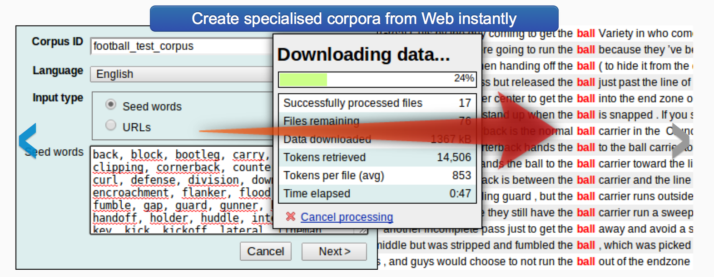</img>


---
## NLP 變成是許多新創數據公司的最愛

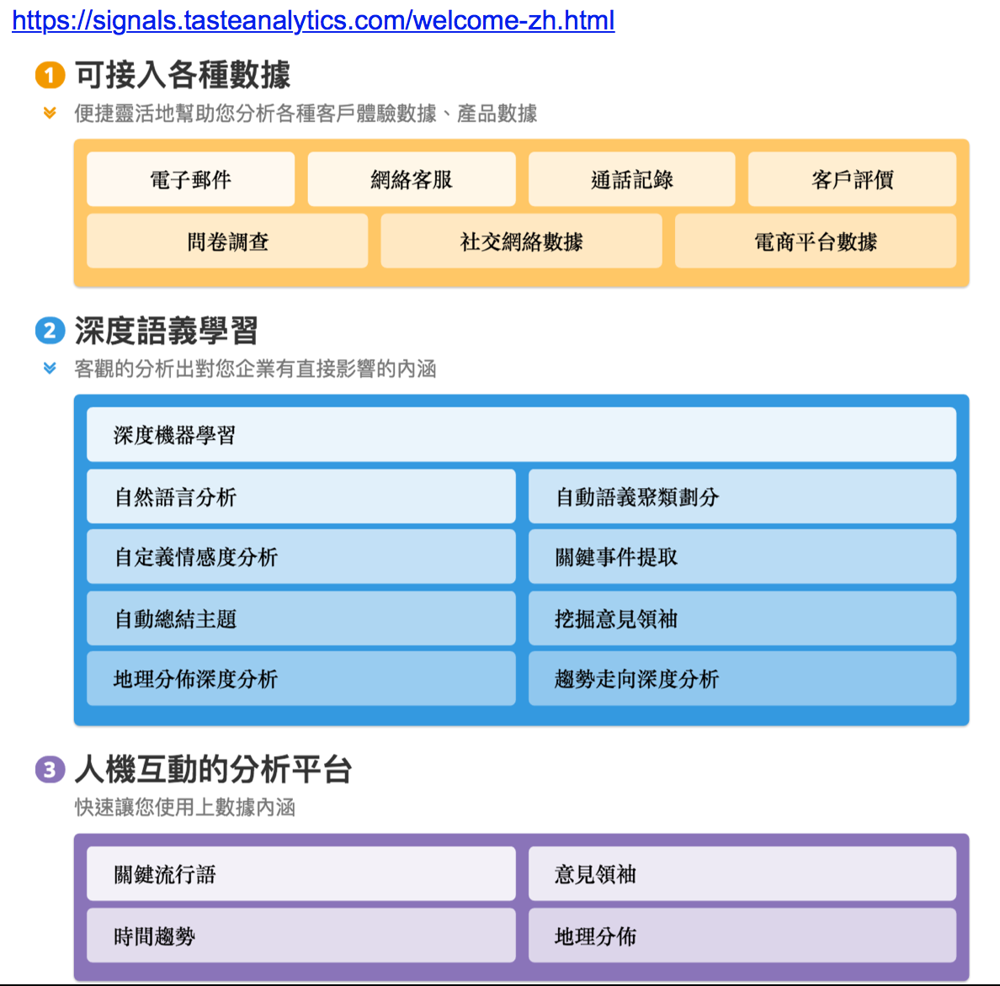</img>

- 先用一個網路服務來初步理解：[BosonNLP](http://bosonnlp.com/)

---
## R 生態提供什麼樣的文本分析資源工具？

- `tm`, `tmcn`, `tidytext` (搭配線上書 [Tidy Text Mining with R](http://tidytextmining.com/)); 參考 `tidytext.r`

- 語言學家的實作：`quanteda` ([Quantitative analysis of Textual Data](http://quanteda.io/)), `corpus` ([introduction](http://corpustext.com/articles/corpus.html)), `koRpus`, `zipfR`, `stylo`([Stylometry with R](https://sites.google.com/site/computationalstylistics/)).... [比較](http://docs.quanteda.io/articles/pkgdown_only/comparison-packages.html)

- 中文社群：`jiebaR`, `tmcn`, `chinese.misc`, `Rweibo`,... `pttR`(?!!)


---
## 腦力激盪一個社會媒體文本專案

### ඩබජජඩඉකනිචකස <span style="color:blue">婉君 婉君 誰是世界上最美麗的人？........</span>.

- 臉書 (`Rfacebook`)／愛居 (`instaR`)／推特 (`twitteR`)


