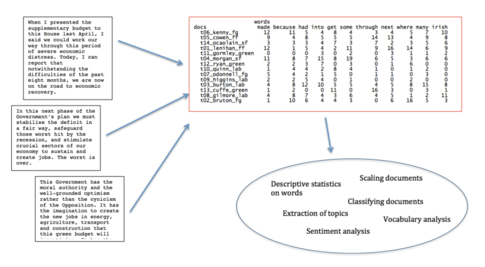
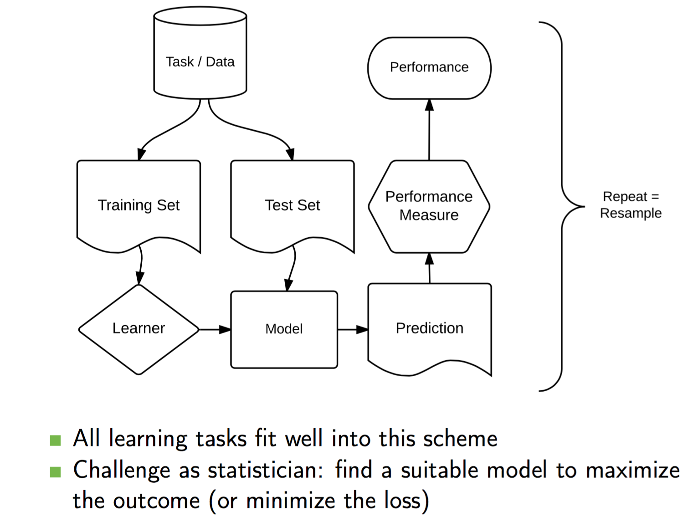
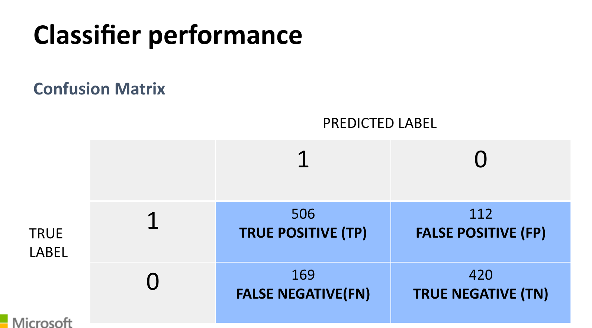
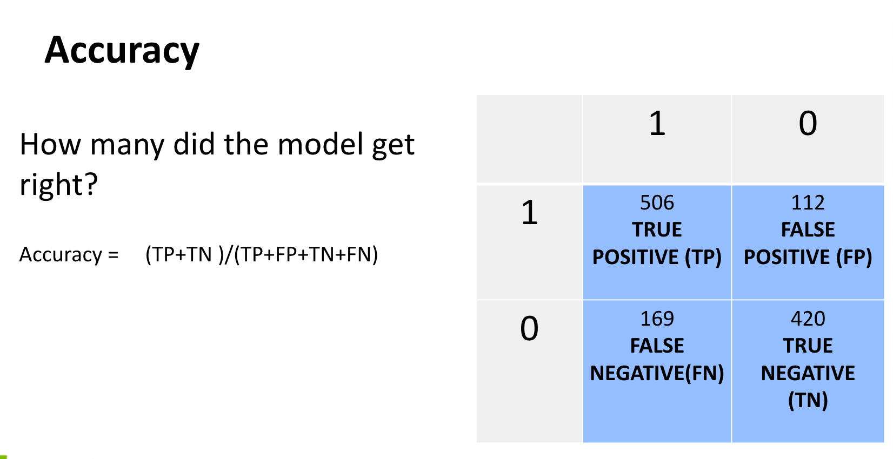
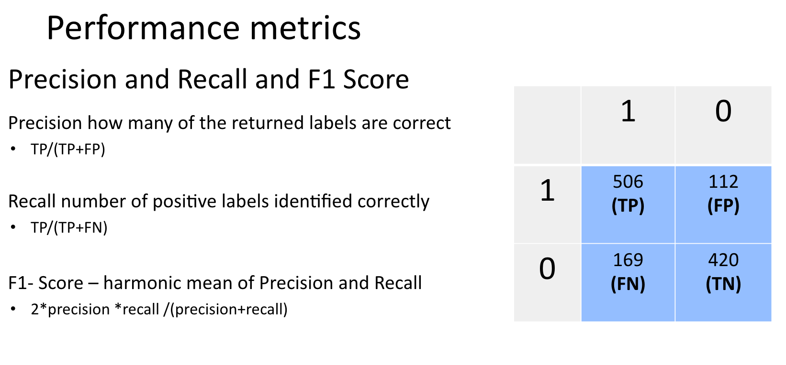

>  `文本分析(text analytics)`、`語料庫(corpus)`、`機器學習(machine learning)`、
> `自然語言處理(natural lanaguage processing)` 之間的關聯

## AI, machine learning, NLP (natural language processing)

- [機器學習](https://zh.wikipedia.org/wiki/%E6%9C%BA%E5%99%A8%E5%AD%A6%E4%B9%A0) 是 AI 的一個核心領域（可以多利用線上課程學習如林軒田老師）
    - 但，*AI 可能跟你想的不一樣*
        - chatbot as Brain-Machine-Interface. <!-- lopechat, autodraw -->
        - creative programming (expressive rather than functional)
        - 人機共存共享福祉的時代的資料科學是什麼樣貌？

- Data science is only useful when the data are used to answer a question / *tell a story*.
    - 數值資料與文本資料互動是當紅的關注焦點。
        - e.g, 如何 (從 ptt) **分析/預測** 鄉民對於某特定政策的 **想法/立場/情緒** ? 如何從使用者(觀影/購物/閱讀/偏好) 行為事件進行 **推薦/行銷**?

## Natural Language Processing (and Corpus Linguistics)
- see slides

## Machine learning 快速插播

- supervised / unsupervised / reinforcement 
    - 可以用中文斷詞問題來想
    - [cheatsheet](https://www.analyticsvidhya.com/blog/2015/09/full-cheatsheet-machine-learning-algorithms/)

- classification / clustering

### 機器學習程式實作基本流程

- [`create_matrix`] 資料清理、標記與表徵轉換 Import your (hand-coded) data into R
- [`create_corpus`] 把「不相關」的資料移除，建立訓練語料 (training dataset) 與測試語料 (test data)
- [`train model(s)`] 選擇模型 Choose machine learning algorithm(s) to train a model
- [`build (classification) model(s)`] Test on the (out-of-sample) test data; establish accuracy criteria 了解成效。
- [`apply (classification) model(s)`] Use model to classify novel data
- [`create analytics`] 把自動分錯的資料找出來 Manually label data that do not meet accuracy criteria

### 整體架構流程 

### 機器學習效能評估 (Performance measure) 的基本量度

- Recall 
- Precision 
- F-score
<http://www.cnblogs.com/bluepoint2009/archive/2012/09/18/precision-recall-f_measures.html>

## 標記與特徵工程 | Annotation and Feature Engineering 
為何要 labeled data?

- Study of recorded human communication
- Summary and quantitative analysis of communicated messages
- Researcher looks for patterns/themes in text; develops `code frame` to categorize text.
- Essentially, variables are extracted from text: Based on scientific method; establishes objectivity via inter-coder reliability.
- Crucial for (supervised) machine learning

### Pros and Cons

優點

- flexible; theoretically-motivated annotation/code frame effrots
- can apply to texts, speech, video, etc.
- 可以用來解決一般機器學習系統 high precision low recall 的問題。把潛在的語意與情緒發掘出來。

缺點

- manually intensive
- thus can be expensive

## 手工標記資料  

- 最簡單可以用 **Excel** 來做：
  - One (or more) column(s) for text data； One column for topic label (as `gold standard`)
  - 通常至少有多於 3000 份標好的文件。
- 大型的專案要考慮到永續、相容、交換等問題，建議使用標記系統。
  - 語料庫和語言處理社群 `GATE`  
  - 質性研究社群 `CAT (Coding Analysis Toolkit)`
  - [lopetator](http://lopen.linguistics.ntu.edu.tw:8001/lope.anno/)
- labeling 和 annotation 的差異。

### Algorithm Example
 
  - 以 `KNN` (K-nearest neighbors algorithm) 為例。
  - [圖解法入門](http://www.r2d3.us/visual-intro-to-machine-learning-part-1/)：基本概念與決策樹(Decision trees)
  - [Essentials of Machine Learning Algorithms (with Python and R Codes)](https://www.analyticsvidhya.com/blog/2015/08/common-machine-learning-algorithms/)

<!--
---
## 效能評估(Performance measure)的基本量度
- ROC (Receiver Operating Characteristic) 曲線

---
## 效能評估(Performance measure)的基本量度

-->

--------------------------
# Quanteda

- alternative to `tm`/`tmcn` (`typical.tm.Rmd`)
- 讓作者自己來講
  - [短講](https://youtu.be/ibP3l2lUF8s)
  - [文件](https://cran.r-project.org/web/packages/quanteda/vignettes/quickstart.html)
  - [小抄](http://muellerstefan.net/files/quanteda-cheatsheet.pdf)

### 英文前處理
- **Tokenization** : task of segmenting running text into words
    - Plain vanilla approaches would just `str split(text," ")`, i.e., splitting by white spaces.
    - More sophisticated methods apply locale (language) specific algorithms.

- **Normalization** : task of putting words/tokens into a standardized
format.
    - For example we’re to we are.
    - Casefolding of tokens (lower-case or upper case)

### 中文前處理

- word segmentation

## 團體作業：總統的語言行為

- 參考資料放在[這裏](https://www.dropbox.com/sh/pbbsla84bq6o678/AACtO1WjaMIxVh97eyWO81yNa?dl=0) 的 usP 和 twP。（或是用 `quanteda` 的資料或其他來源皆可）。
- 小組討論出想要看到的現象
    - 那個美國總統最多話 (tokens)，用字量最豐富 (types) ？
    - 那個台灣總統使用最多的第一人稱代名詞 (我，我們)？
    - 所有總統都用到的名詞表？
    - . . . . . . . . . . . . . . . . . .
- (Bonus) 爬川普與小英的資料進來做。

-----------------------------
[Ref]

- Benoit K (2017). _quanteda: Quantitative Analysis of Textual
Data_. doi: 10.5281/zenodo.1004683 (http://quanteda.io)

